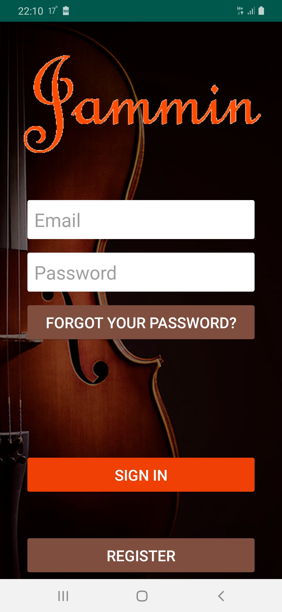
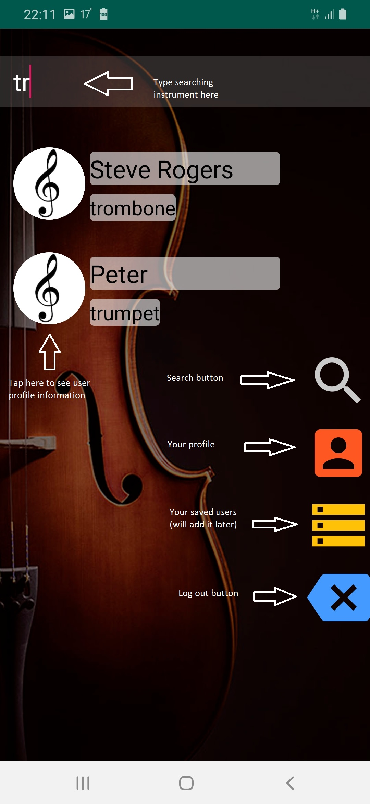

# Jammin

This application helps find a musician by typing their instrument.
Just type any of musical instrument in search field, and Jammin will show all registered users which play that kind of
instrument. You can see user's profile by taping on them on the list.

## Installation

Required for using:
min Android 5.0,
Internet access,
registration in app.

## Screenshots

## Library

Project is created with:
* OkHttp version: 4.1.0
* Retrofit version: 2.6.1
* RxJava version: 2.2.10
* Backendless

## Versioning
1.0
